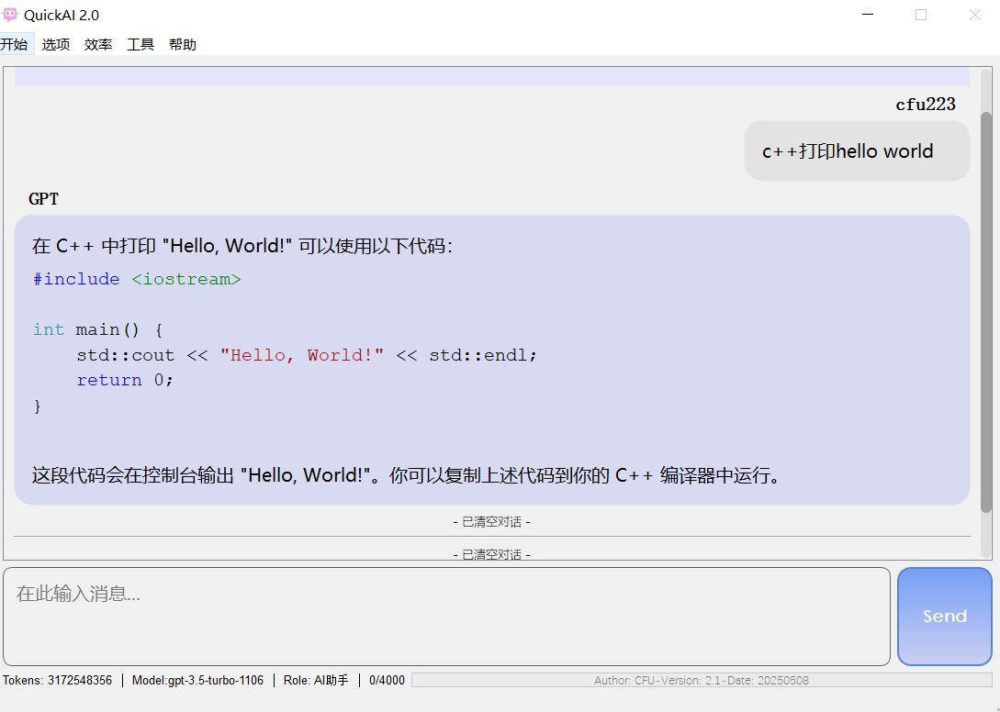

# Quick AI



## start

* 下载pandoc至bin目录
* 重名settings.json.tmp成settings.json，填入你的api key
  gpt模型使用的是一个免费镜像站：https://github.com/chatanywhere/GPT_API_free/tree/main
* 运行QuickChat.py
* 运行tools/生成序列号.py获取
* 填入user.json配置文件中

## todo list

- [x] 图标
- [x] 清空屏幕
- [x] 网络请求时的线程分离
- [x] 界面美化发送按钮
- [x] 界面美化代码块高亮
- [ ] 主题
- [x] 打开导出对话目录
- [x] 利用pandoc导出
- [ ] 语音输入
- [ ] deepseek 思维链显示
- [ ] 滚动条置底可以打断
- [x] 重启app
- [ ] 内置chrome内核
- [ ] 重构代码
- [x] 快捷备忘录
- [ ] 本地视频服务
- [ ] 阿里云盘挂载

## 打包命令

```shell
pyinstaller -Dw .\QuickChat.py -i .\quickAI.ico
```